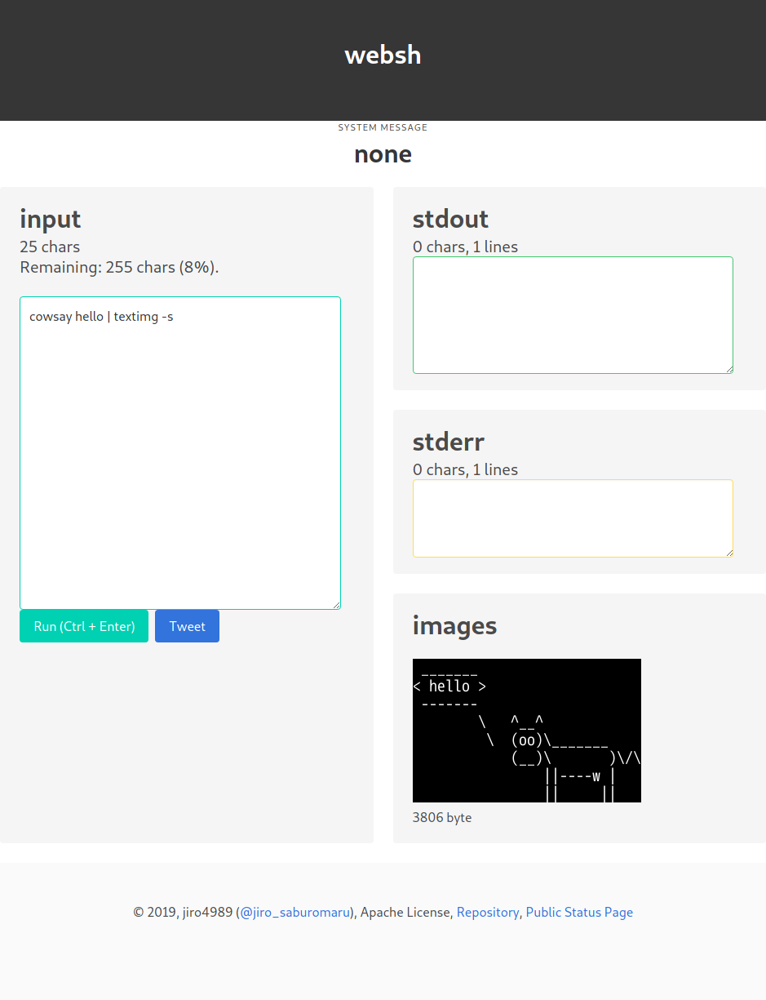
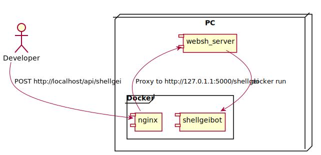

= websh
:toc: left
:sectnums:

シェル芸botのDockerイメージを利用したWeb移植。

== 背景

https://github.com/theoremoon/ShellgeiBot[シェル芸bot]のWeb移植の
https://github.com/kekeho/SGWeb[SGWeb]というWebアプリがある。

最新のシェル芸botに追従してなかったので、試しに自分が最新のシェル芸botに追従する
Webアプリ作って公開してみるか、と思ったから。
あとWebアプリを作る勉強もかねて。

== システム構成

* フロントエンド
** Nim (karax)
* バックエンド
** Nim (jester)
** Docker

=== ローカル環境

シェル芸botのDockerコンテナをDockerコンテナ内で起動したくなかった(docker on docker)ので
websh_serverをホストPCで実行するようにしている。

nginxはコンテナ内からホストPCのwebsh_serverにリバースプロキシしてシェル芸botコンテナを操作する。

.ローカル環境の構成図

=== 本番環境

Infrastructure as Codeしている。
ソースコードは https://github.com/jiro4989/infra[infra]リポジトリで管理。
以下はアプリレベルでの構成図。

.システム構成図
image:./docs/system.svg[システム構成図]

== API

実体はフロントエンドのHTMLからAPIリクエストして実行結果を受け取ってるだけです。
なので普通にcurlでPOSTリクエスト送れば画面がなくても動きます。

以下のようなリクエストを送ればコマンドラインからwebshを使用できます。

[source,bash]
----
curl -X POST -d '{"code":"echo hello"}' 'https://websh.jiro4989.com/api/shellgei'
----

== 開発

=== ファイル・ディレクトリ構成

[options="header"]
|=================
| パス                  | 説明
| docs                  | READMEの画像ファイルなど
| proxy                 | ローカル開発用のnginxの設定
| websh_front           | フロントエンドのソースコード
| websh_server          | バックエンドのソースコード
| config.nims           | タスク定義
| Dockerfile            | ローカル開発でのみ使用する
| docker-compose.yml    | ローカル開発でのみ使用する開発環境設定
| docker-compose-ci.yml | GitHub Actionsでのみ使用する
|=================

=== 開発環境の起動方法

リポジトリのルート直下の `config.nims` にリポジトリ内で使用するタスクを定義して
いる。
以下のコマンドをリポジトリディレクトリ配下で実行する。

[source,bash]
----
# 最初の一度、あるいはDockerイメージを更新したいときだけ実行
nim --hints:off pullShellgeiBotImage

# 開発環境の起動
nim --hints:off run
----

サーバを起動して待機状態になったら、ブラウザで以下のページにアクセスする。

http://localhost

=== フロントエンド

link:./websh_front/README.adoc[websh_frontディレクトリ配下のREADME]を参照。

=== バックエンド

link:./websh_server/README.adoc[websh_serverディレクトリ配下のREADME]を参照。

=== CI

`.github` ディレクトリ配下に設定を配置している。
以下処理フロー。

. DockerHubから開発環境のDockerイメージを取得
. docker-compose upでフロントのJSとバックエンドのバイナリを生成
. リリース用にファイルを圧縮
. (以降はタグを切ったときだけ)
.. 圧縮したファイルをGitHub Releaseにリリース
.. 本番サーバ上のWebhookにGETリクエストを送信してリリース物をデプロイ

== プルリクエスト

デザインとか超手抜きですので、プルリクエストお待ちしてます。

== 多謝

* https://github.com/theoremoon/ShellgeiBot[シェル芸bot]
* https://github.com/theoremoon/ShellgeiBot-Image[シェル芸botのDockerイメージ]
* https://github.com/kekeho/SGWeb[SGWeb]
