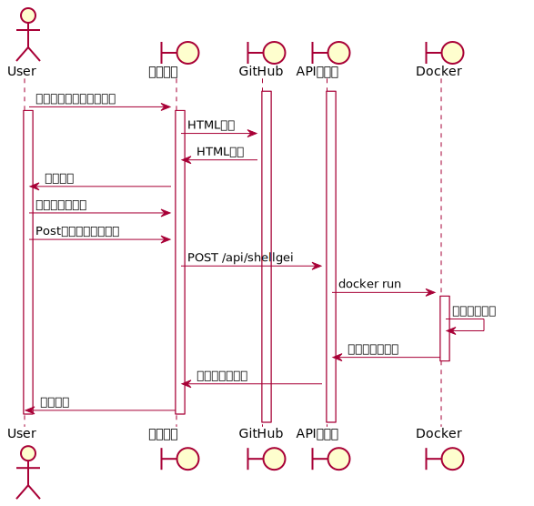

= shellgei-web
:toc: left
:sectnums:

シェル芸botのDockerイメージを利用したWeb移植。

TODO やれたらやる

== 構成

フロントエンドはすべてGitHubPagesに丸投げする。 +
バックエンドのAPIとシェル芸botコンテナのみをAWS上で動かす。

AWSインフラの設定はこのリポジトリでは管理しない。

* フロントエンド
** GitHub pages
* バックエンド (API)
** Nginx (Proxy)
** Nim (API frontend)
** Docker (API backend)

== URL

[options="header"]
|=================
| 分類 | Method | URL
| トップページ | GET | https://jiro4989.github.io/shellgei-web/
| シェル芸の実行 | POST | https://jiro4989.github.io/shellgei-web/api/shellgei
|=================

== シーケンス図

ユーザアクセスからのデータのやり取り

== フロントエンド

gh-pagesブランチに必要なhtmlやcssのみ配置する。
CI環境でビルドしてgh-pagesにpushする。

とりあえず今は仮で平のHTMLとAPIリクエストのボタンだけ配置する。

== バックエンド

Nimのjesterというモジュールを使ってAPIサーバのバイナリを生成する。
生成したバイナリだけをコンテナに含める。

コレも可能ならCI環境でビルドしてDockerHubにpushしたい。
