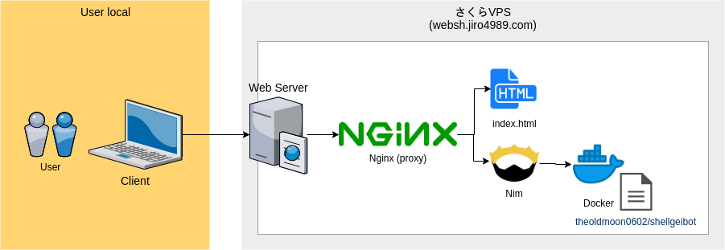
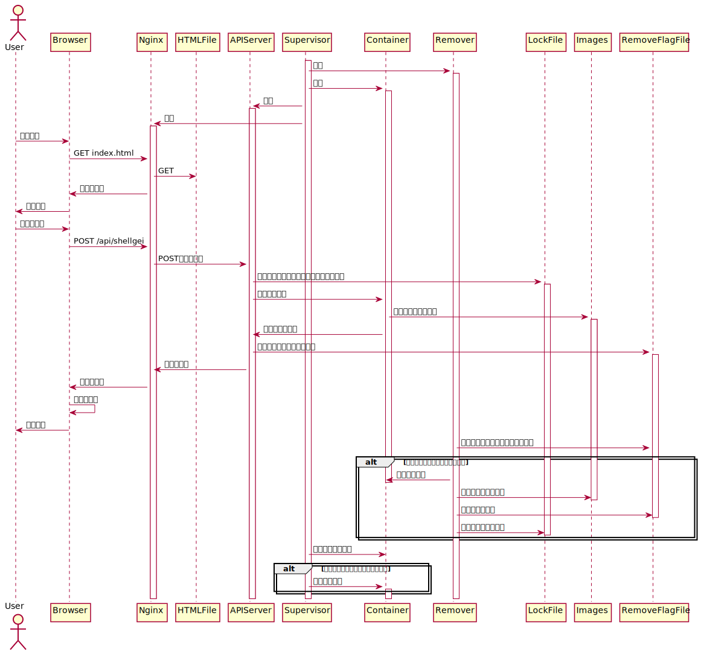
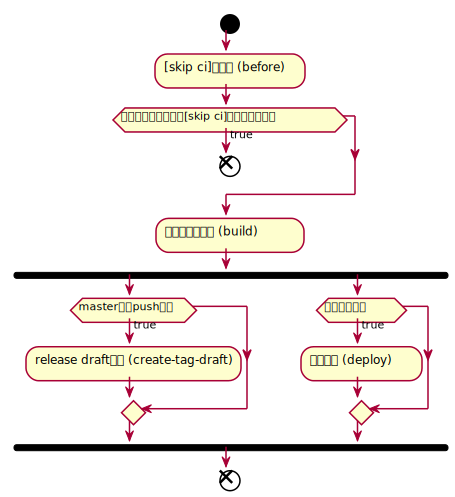
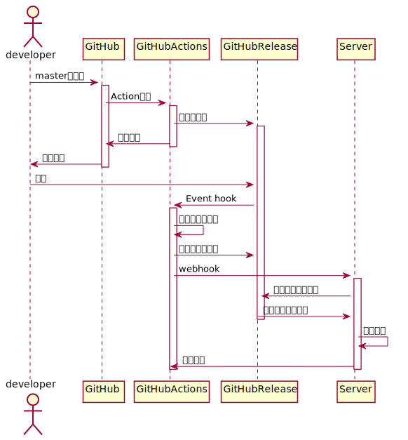

==========================================
websh - Web shellgei execution environment
==========================================

.. raw:: html

   <h3 align="center">
     
   </h3>
   

     
     
     
   

| websh はWebブラウザ上でシェル芸botの実行環境を提供するWebアプリです。
| シェル芸の実行はDockerコンテナ上で行っており、イメージに `シェル芸botのDockerイメージ`_ を使用しています。

* https://websh.jiro4989.com/

|image-top|

.. contents:: 目次

使い方
====

ブラウザ
----

* 画面を表示する
* 画面左のtextareaにシェルを入力する
* 画面左のRunボタンを押す
* 結果が画面右のtextareaにセットされる
* やりたかったらTweetボタンでつぶやく

API
----

実体はフロントエンドのHTMLからAPIリクエストして実行結果を受け取ってるだけです。
なので普通にcurlでPOSTリクエスト送れば画面がなくても動きます。

以下のようなリクエストを送ればコマンドラインからwebshを使用できます。

.. code-block:: shell

   curl -X POST -d '{"code":"echo hello", "images":[]}' 'https://websh.jiro4989.com/api/shellgei'

`images` にbase64エンコードした画像ファイルを含めるとwebsh上の `/media` 配下にア
ップロードしたファイルがbase64デコードされて配置されます。

詳細なAPI仕様は https://jiro4989.github.io/websh/swagger.html を参照してください
。

コマンドラインツール
--------------------

3rd partyのコマンドラインツールが存在します。多謝。

* https://github.com/Khronos31/scripts/blob/master/bin/websh
* https://github.com/eggplants/websh.sh
* https://github.com/sheepla/websh-cli
* https://github.com/yuu528/sgb

一応自前で作ったコマンドラインツールもある。

* https://github.com/jiro4989/websh-go

動作環境
====

PCのChrome最新版のみサポートしています。

Chrome以外のブラウザでも動くかもしれないですが、動かなくなっても知らないです。
スマホも動作確認してないので動くかもしれないですし、動かないかもしれないです。

PCのChromeで操作してください。

開発の背景
====

`シェル芸Bot`_ のWeb移植の SGWeb_ というWebアプリがある。

最新のシェル芸botに追従してなかったので、試しに自分が最新のシェル芸botに追従する
Webアプリ作って公開してみるか、と思ったから。
あとWebアプリを作る勉強もかねて。

システム構成
============

* フロントエンド

  * Nim_ ( Karax_ )

* バックエンド

  * Nim_ ( Jester_ )
  * Docker

ローカル環境
------------

アプリはすべてDockerコンテナ上で動作する。

ブラウザの画面からシェルを実行するとコンテナ上のNginxへリクエストが流れる。
Nginxはリバースプロキシし、コンテナ上のAPIサーバがリクエストを受ける。

APIサーバはホストネットワーク上のDockerAPIを使用して、
シェル芸Botコンテナを操作する。

画像ファイルなどを配置する一時ディレクトリの後始末は
APIサーバからは行わず、removerコンテナが非同期に削除する。

.. code-block:: mermaid

   flowchart TD
       u[developer] --> n[nginx]
       subgraph PC
           n --> s[websh_server]
           subgraph Application
               s --> fs[file_system]
               r[websh_remover] --> fs
           end
           sgb[ShellGeiBot] --> fs
       end

本番環境
---------

Infrastructure as Code (Ansible) している。
ソースコードは infra_ リポジトリ（非公開）で管理。

監視系はローカルPCのDockerコンテナ上で動作するGrafanaとPrometheusで実施。
`nimbot <https://github.com/jiro4989/nimbot/>`_ はSlack用のBotで、
websh用のサーバに後乗せで一緒に稼働している。

ログは一旦ローカルに書き出したファイルをFluentdが拾ってJSON形式に変換して保存。
GrafanaLokiがログを拾って、Grafanaからログを取得してログ監視をしている。

|image-system|

基本設計
================

ブラウザからPOSTリクエストを受け、POSTの内容を取得し、Dockerコンテナ内でシェルを実行する。

コンテナは状態を保持しないようにする。
一度リクエストをしたあと、再度コンテナにリクエストをしても、前回実行した結果はコンテナ内に残らないようにする。
リクエストの都度、コンテナを破棄して生成するようにする。

ただしコンテナの破棄と生成はAPIサーバプロセス自体は実施しない。
コンテナの破棄と起動には時間がかかり、合計で約2秒ほどかかってしまう。
レスポンスタイム向上のため、コンテナの破棄と生成は別プロセスが引き受けるようにする。
APIサーバはコンテナの破棄のトリガーを生成するのみに留める。

コンテナの起動はインフラ側のsupervisorが引受ける。
コンテナや画像ファイルの破棄は別APIサーバとは別プロセスが引き受ける。

以上を踏まえて、Webからのリクエストを受けてレスポンスを返すまでの一連の処理フローは以下の通り。

|image-proc-flow|

開発
====

前提条件
--------

以下のツールがインストールされている必要があります。

* Nim_
* Docker
* Docker-compose

ファイル・ディレクトリ構成
--------------------------

=====================   ========================================
Path                    Description
=====================   ========================================
docs                    READMEの画像ファイルなど
nginx                   ローカル開発用のnginxの設定
websh_front             フロントエンドのプログラム
websh_server            バックエンドのAPIサーバのプログラム
websh_remover           バックエンドの後始末を行うプログラム
Dockerfile              アプリのDockerイメージ
docker-compose.yml      ローカル開発でのみ使用する開発環境設定
=====================   ========================================

開発環境の起動方法
------------------

DockerをAPIで操作できるようにする必要がある。
Linux環境ではSystemdでDockerを起動しているはず。
docker.serviceを以下のように修正する。

``/lib/systemd/system/docker.service``

.. code-block:: ini

   # ここを
   ExecStart=/usr/bin/dockerd -H fd:// --containerd=/run/containerd/containerd.sock

   # こう修正
   ExecStart=/usr/bin/dockerd -H tcp://0.0.0.0:2376 -H fd:// --containerd=/run/containerd/containerd.sock

以下のコマンドをリポジトリディレクトリ配下で実行する。

.. code-block:: shell

   # シェル芸botのイメージを取得 (巨大なので注意)
   docker pull theoldmoon0602/shellgeibot
   docker-compose build
   docker-compose up

サーバを起動して待機状態になったら、ブラウザで以下のページにアクセスする。

http://localhost

ブランチ運用
------------

以下の5種類のブランチを使う。

================   =============================================================================
Branch name        Description
================   =============================================================================
master             本番用
feature/#xx-desc   新機能、UI改善
hotfix/#xx-desc    バグ修正
chore/#xx-desc     CIやローカル開発環境の整備など、アプリに影響しない雑多なもの
================   =============================================================================

feature, hotfix, choreのブランチ名のプレフィックスは、PR作成時のラベル自動付与にも使用している。
よって、必ずブランチ命名規則を守ること。

1つずつリリースしたいので各ブランチからmasterにPRを出す。
複数の改修をまとめてリリースしたい時だけdevelopブランチを使う。

ドキュメントの更新だけの場合はmasterブランチから直接pushする。
この時は必ずコミットログに `[skip ci]` を含めなければならない。
masterブランチのCIが走るとリリースドラフトが生成されてしまうため。
詳細は CI のセクションを参照。

フロントエンド
--------------

`websh_frontディレクトリ配下のREADME`_ を参照。

バックエンド
------------

`websh_serverディレクトリ配下のREADME`_ を参照。

API仕様の更新と確認
----

`public` ディレクトリ配下にWebshのAPI仕様を定義している。
API仕様が変わった場合は、こちらも合わせて更新する。
API仕様はOpenAPI 3.0.2を使用している。
API仕様はGitHub Pagesで閲覧できる。masterブランチが更新されると自動で反映される。

更新したswagger.yamlをローカルで確認する場合は、以下のコマンドを実行してローカル
でサーバを起動して確認する。

.. code-block:: shell

   $ cd public
   $ python3 -m http.server

サーバを起動したら http://localhost:8000/swagger.html を開いて画面が期待通り描画
されるかを確認する。

CI
----

`.github` ディレクトリ配下にワークフローを定義している。
ビルド、テスト、デプロイのフローは `.github/workflows/main.yml` に定義している。

CIのジョブフローは以下。

|image-ci-flow|

masterブランチでのpush、margeの場合は `create-tag-draft` が実行される。

`create-tag-draft` ではタグのドラフトを作成する。
タグのドラフトは、PRの説明から自動でセットされる。
Feature/BugFixなどの分類は、 PR時のラベルでカテゴライズされる。

PR時のラベルはブランチのプレフィックスから自動でセットされる。
ブランチ命名規則については <<開発,ブランチ運用>> を参照。

タグドラフトをpublishすると `deploy` が実行され、サーバ上にmasterのビルド成果物をデプロイする。

デプロイ方法
------------

前述のCIの通り、リリースを作成すると自動でデプロイされる。

リリースの下書きはGitHub Actionsが下書きを作成する。
下書きをpublishすると、GitHub Actionが起動して、デプロイされる。
以下はデプロイのフロー。

|image-release-flow|

プルリクエスト
==============

デザインとか超手抜きですので、プルリクエストお待ちしてます。

LICENSE
=======

Apache License

多謝
====

* `シェル芸Bot`_
* `シェル芸botのDockerイメージ`_
* SGWeb_

.. _`シェル芸botのDockerイメージ`: https://github.com/theoremoon/ShellgeiBot-Image
.. _`シェル芸Bot`: https://github.com/theoremoon/ShellgeiBot
.. _SGWeb: https://github.com/kekeho/SGWeb
.. _infra: https://github.com/jiro4989/infra
.. _`websh_frontディレクトリ配下のREADME`: ./websh_front/README.rst
.. _`websh_serverディレクトリ配下のREADME`: ./websh_server/README.rst

.. |image-top| image:: ./docs/top.png

.. _Nim: https://nim-lang.org/
.. _Karax: https://github.com/pragmagic/karax
.. _Jester: https://github.com/dom96/jester
