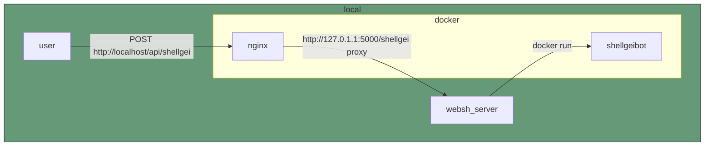

```mermaid
graph TB
  subgraph local
    style local fill:#697,stroke:#333,stroke-width:1px

    subgraph docker
        nginx
        shellgeibot
    end
    user -->|POST http://localhost/api/shellgei| nginx
    nginx -->|http://127.0.1.1:5000/shellgei proxy| websh_server
    websh_server -->|docker run| shellgeibot
  end
```